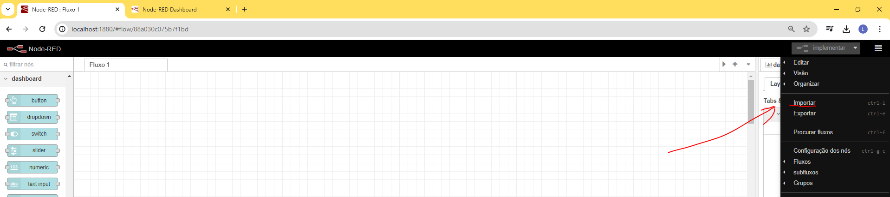
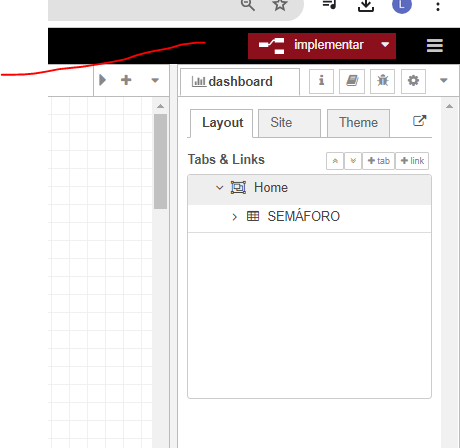
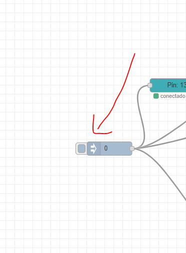

# SEMÁFORO NODE RED

<pre>
Abra o arduíno IDE e instala a biblioteca firmata conforme exemplo e depois carregue o código standard firmata
  
</pre>

<PRE>
  Inicie o node-red via terminal
</PRE>
<pre>
  node-red
</pre>

<pre>
  Acesse o endereço:
</pre>

<pre>
  localhost:1880
</pre>

<IMPORTE O ARQUIVO "semaforo1.json" presente no github

 
<pre>
  Clique em implementar
</pre>

<pre>
  Clique na caixa inject e poderá visualizar seu projeto pelo link :
</pre>
<pre>
  localhost:1880/ui
</pre>
 
<pre>
Segue diagrama eletrônico 
</pre>

 

